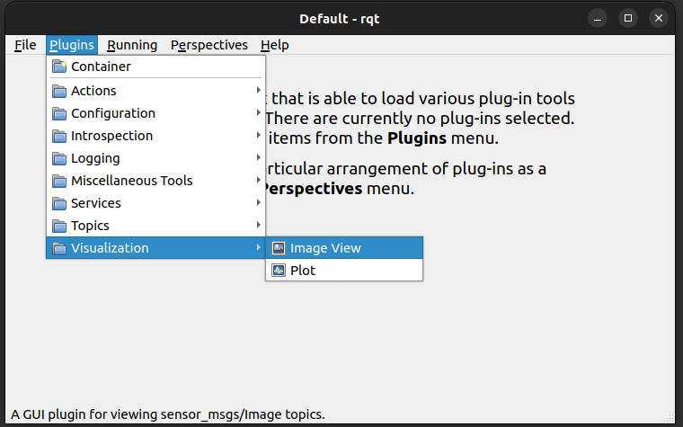

# ROS2 Tutorial: Image Transport Plugins (C++) [ESPAÑOL/SPANISH]

* Autor: Agutig (Álvaro "Guti" Gutiérrez García)
* Ultima revisión: Mayo 2024
* Version de ROS 2: Humble.

## Resumen

Este tutorial proporciona una explicación minuciosa de cómo desarrollar un plugin de video para el paquete [Image_transport](http://wiki.ros.org/image_transport). Se presenta un ejemplo básico y detallado, denominado 'basic_plugin', que cubre los requisitos mínimos necesarios, incluyendo interfaces y archivos. A partir de este ejemplo, el tutorial progresará hacia conceptos y funciones más complejos. Todo el código utilizado en el tutorial se puede encontrar y utilizar en este [link](https://github.com/agutig/ROS2_tutorial_image_transport_plugins/tree/main/basic_plugin_ws/src"¡)


## Introducción

Image_transport es un paquete esencial de ROS 2 diseñado para la captura y transmisión de imágenes y videos a través de la red de nodos. Este paquete soporta el uso de "plugins" que permiten procesar imágenes en bruto antes de su publicación. Estos plugins son modulares y pueden ser intercambiados en tiempo real durante la ejecución, sin necesidad de ser lanzados como un nodo convencional.

Esta característica es particularmente valiosa para el desarrollo de codificadores de imágenes y videos, que optimizan el volumen de datos transmitidos —una consideración crucial dado que los videos pueden ser particularmente grandes— ayudando así a preservar la eficiencia de la red del robot. Los plugins actuales, principalmente utilizados para la codificación, están disponibles en [GitHub.](https://github.com/ros-perception/image_transport_plugins.) Sin embargo, existen múltiples posibilidades aún por explorar, por lo que el primer paso para desarrollar un nuevo plugin sería definir sus funcionalidades deseadas.


Los plugins de image_transport se pueden diseñar para dos esquemas principalmente:

1. **Procesamiento Directo**: Consistiria en recibir una señal de video en formato crudo (msg:image), modificarla según sea necesario, y transmitir la imagen resultante en el mismo formato (msg:image). Un ejemplo práctico de este enfoque es el uso de un plugin que ajusta automáticamente la resolución del video a un aspecto de 16:9, garantizando así las dimensiones de las imagenes, independientemente de la cámara utilizada. Otros usos pueden incluir la rotación de la imagen, transformaciones de color o ajustes similares. Este tipo de procesamiento se realiza mediante un único plugin (plugin publicador).
   
2. **Procesamiento Doble (Codecs)**: Este esquema es el utilizado por los codecs de video y consiste en el uso de dos plugins coordinados (publicador-subscriptor) que
    se comunican entre ellos usando una interfaz distinta a (`msg:image`).Para explicarlo con sencillez, explicaremos su funcionamiento como si estuviera estaria 
    actuando como tal.

   - **Plugin publicador (Codificador)**: Recibe la señal de video, la codifica reduciendo su tamaño, convierte el contenido en una interfaz distinta
   que permite hacer una compresion mayor(`msg:codec_interface`), y la transmite.

   - **Plugin subscriptor (Decodificador)**: Con otro plugin, recibe el mensage (`msg:codec_interface`) y lo decodifica de vuelta a (`msg:image`) para que pueda
   ser visualizado.
   

Dado que el esquema de procesamiento con doble plugin es más complejo y también facilita la explicación del esquema de procesamiento directo, se ha decidido ofrecer una explicación detallada de este, acompañada de un ejemplo de código disponible en el repositorio de GitHub en el siguiente [enlace.](https://github.com/ros-perception/image_transport_plugins.). Este código no solo será utilizado para explicar el tutorial, sino que también servirá como referencia para proyectos similares. Además, se incluye un ejemplo de una interfaz personalizada que se utiliza para simplificar el proceso.

El tutorial comenzará con el ejemplo más sencillo posible, y se irá ampliando gradualmente con funciones adicionales para explicar aspectos más avanzados de los plugins de image_transport.

## Otras indicaciones

Además, es importante destacar que existen dos tipos de implementaciones de clases para los plugins de transporte de imágenes:

- `image_transport::PublisherPlugin<>` | `image_transport::SubscriberPlugin<>`
- `image_transport::SimplePublisherPlugin<>` | `image_transport::SimpleSubscriberPlugin<>`

La versión original (`PublisherPlugin` y `SubscriberPlugin`) es más completa pero menos utilizada en implementaciones actuales. La versión simplificada (`SimplePublisherPlugin` y `SimpleSubscriberPlugin`) es más extendida y permite una implementación más sencilla con más parámetros por defecto.

## Tutorial Básico

### Paso 1: Crear el Paquete
Crea el paquete como se hace habitualmente. En este paquete alamacenaremos el codigo de nuestros plugins y conviene no mezclar código con otras cosas que no 
sea exclusivas de estos plugins para mantenerlo todo limpio y claro.

```Terminal
ros2 pkg create --build-type ament_cmake <package_name>
```

### Paso 2: Crear una interfaz personalizada
Si estas siguiendo un esquema de un unico plugin subscriptor este paso te lo podrás saltar porque solo manejaras interfaces de tipo sensor_msgs::msg::Image tanto
a la entrada como a la salida del plugin. Sin embargo, para esquemas bi-plugins como puede ser un codec de video si será necesario diseñar una interfaz personalizada
para la comunicacion entre el plugin publicador y el plugin subscriptor.

Para este tutorial actual, se desarrolló una interfaz específica que permite descomponer una imagen en bruto en sus tres canales principales: Rojo (R), Verde (G) y Azul (B). Cada canal será transformado de una matriz de dimensiones específicas (por ejemplo, 1280x720) a un vector plano con una longitud equivalente al número de píxeles de la imagen (en este caso, 921600). Además, se incorporan dos variables enteras, original_width y original_height, que permiten reorganizar los vectores y reconstruir la imagen en sus dimensiones originales en la interfaz propuesta.

```cpp
# BASIC.msg

uint16 original_width
uint16 original_height

uint8[] vector_r #R matrix flattened into a vector 
uint8[] vector_g #G matrix flattened into a vector 
uint8[] vector_b #B matrix flattened into a vector 
```

Para hacer una interfaz personalizada, te recomiendo que sigas este otro tutorial que tengo subido en este [link]("")


### Paso 3: Definición Header del plugin Publisher (.h)

Crea en la carpeta `include` la definición del publisher en el archivo `publisher.h`. Este archivo necesitará:

- **Namespace**: Utiliza un namespace para identificar las clases del plugin. Independientemente de si usas un plugin individual o combinas un plugin publicador con un subscriptor, es recomendable utilizar el mismo namespace a lo largo del proyecto para mantener la sencillez. Normalmente, se utiliza el nombre del paquete.
  
- **Método `getTransportName()`**: Este método devuelve el identificador del flujo de video, el cual es crucial para la comunicación correcta entre los plugins en estructuras de doble plugin. Al utilizar un plugin de transporte de imágenes, normalmente se añade un sufijo al tópico `/camera_image`, como por ejemplo `/camera_image/basic`.

- **Función de Publicación**: Define la función que modificará el mensaje y lo retransmitirá. La implementación de esta función se especificará más adelante y no se incluye directamente en el archivo `.h`.

  ```cpp
  virtual void publish(const sensor_msgs::msg::Image& message, const PublishFn& publish_fn) const override;

Finalmente, el codigo de este archivo quedaria como:

```cpp
    #ifndef BASIC_PLUGIN_BASIC_SUBSCRIBER_H
    #define BASIC_PLUGIN_BASIC_SUBSCRIBER_H

    #include <rclcpp/rclcpp.hpp>
    #include <image_transport/simple_subscriber_plugin.hpp>
    #include <sensor_msgs/msg/image.hpp>

    #include "coded_interfaces/msg/basic.hpp" // Import the personalized interface.

    namespace basic_plugin { //IMPORTANT THE NAMESPACE, to keep it clean i made the same namespace for both pub and sub plugins

    /**
     * A SimpleSubscriberPlugin example for understanding image_transport_plugins by
     * subscribing to coded_interfaces::msg::Basic and converting it to sensor_msgs::msg::Image.
     */

    class BasicSubscriber final : public image_transport::SimpleSubscriberPlugin<coded_interfaces::msg::Basic>
    /**
     * Base class for the "basic" subscriber plugin. It converts:
     * video "coded" (coded_interfaces::msg::Basic) --> video raw (sensor_msgs::msg::Image)
    */
    {
    public:
    /** ~BasicSubscriber
     * 
     * Destructor for BasicSubscriber.
     */
    virtual ~BasicSubscriber() = default;

    /** getTransportName
     * 
     * Gets the transport name for this plugin. This is the identifier of the full transport (both plugins)
     * (subscriber and publisher) and has to be the same in both header files.
     * 
     */
    virtual std::string getTransportName() const
    {
        return "basic";
    }

    protected:

    /** internalCallback
     * 
     * Callback method for handling coded_interfaces::msg::Basic messages.
     * Converts the coded_interfaces::msg::Basic message to sensor_msgs::msg::Image.
     * 
     * - message The received coded_interfaces::msg::Basic message.
     * - user_cb The callback function to call with the converted sensor_msgs::msg::Image message.
     */

    void internalCallback(const coded_interfaces::msg::Basic::ConstSharedPtr& message, const Callback& user_cb) override;

    }; // namespace basic_subscriber
    }

    #endif // BASIC_PLUGIN_BASIC_SUBSCRIBER_H
```


### Paso 4: Descripción del Publisher (.cpp)
Luego se pasará a crear la implementación de la clase, para ello creamos un archivo con el mismo nombre pero con extensión .cpp en la carpeta src. En este archivo:

* Utilizaremos el namespace definido anteriormente
* Crearemos la función que se llamará cada vez que reciba un mensaje de video (publish). 

```cpp
void BASICPublisher::publish(const sensor_msgs::msg::Image& message, const PublishFn& publish_fn) const
```

Donde: 
* Dentro de esta función, con el parámetro de entrada podremos llamar a la función que se pasa como parámetro de entrada PublishFn, publicará el nuevo mensaje
* El mensaje recibido se encuentra en la variable message.

El codigo seria algo como esto:

```cpp

#include "basic_plugin/basic_publisher.h"
#include <pluginlib/class_list_macros.hpp>
#include <cv_bridge/cv_bridge.h>
#include <sensor_msgs/msg/image.hpp>

#include "coded_interfaces/msg/basic.hpp" //Import the personalized interface.

namespace basic_plugin { //IMPORTANT THE NAMESPACE.
  
  /**
  In this script, the defined functions in basic_publisher.h are developed.
  */

  void BasicPublisher::publish(const sensor_msgs::msg::Image& message, const PublishFn& publish_fn) const {

  /**
   * Recives a sensor_msgs::msg::Image message through the message vairable. You can operate the message as desired
   * but at the end, it must be converted to coded_interfaces::msg::Basic. For demonstration, this function flips
   * upside down the image to ensure that the both plugins operate properly.
   * 
   * - message The image message to publish.
   * - publish_fn The function to call to publish the message. Just call the function.
   */


    //This lines convert the message sensor_msgs::msg::Image into an OPenCV image (cv::Mat) to apply
    // Cool maths to it
    cv_bridge::CvImagePtr cv_ptr;
    try {
        cv_ptr = cv_bridge::toCvCopy(message, sensor_msgs::image_encodings::BGR8);
    } catch (cv_bridge::Exception& e) {
        RCLCPP_ERROR(rclcpp::get_logger("rclcpp"), "cv_bridge exception: %s", e.what());
        return;
    }

    // Invert the image (flip vertically)
    cv::Mat inverted_image;
    cv::flip(cv_ptr->image, inverted_image, 0);


    //Create the new basic msg and fill it with known information.
    /* For a reference, this is how Basic msg structure looks like
      # Basic.msg

      uint16 original_width
      uint16 original_height

      uint8[] vector_r #R matrix flattened into a vector 
      uint8[] vector_g #G matrix flattened into a vector  
      uint8[] vector_b #B matrix flattened into a vector  
    */

    coded_interfaces::msg::Basic new_message; //Create empty msg
    new_message.original_width = inverted_image.cols; // Add original img width
    new_message.original_height = inverted_image.rows; // Add original img height

    // Flatten the image into a single vector and assign it to the message
    cv::Mat channels[3];
    // Separate the image into R, G, B channels
    cv::split(inverted_image, channels);

    // Fill the msg with the flattened R-G-B channels. 
    new_message.vector_r.assign(channels[2].data, channels[2].data + channels[2].total());
    new_message.vector_g.assign(channels[1].data, channels[1].data + channels[1].total());
    new_message.vector_b.assign(channels[0].data, channels[0].data + channels[0].total());

    // Publish the Basic message
    publish_fn(new_message);

    //This is a log to check that everything is going well but dont forget to delete it before using
    //your final implementation
    RCLCPP_INFO(rclcpp::get_logger("basic_publisher"), "Published message on topic: %s with transport: %s", this->getTopic().c_str(), getTransportName().c_str());
  }
} // namespace basic_publisher

```

### Paso 5: Definición del Header del plugin subscriptor (.h)

De forma similar al paso 2, crearemos un archivo "x_subscriber.h" en include/nombre_paquete in en el una clase subscriber que herede de image_transport::SimpleSubscriberPlugin. En este archivo, tendremos que tener en cuenta los dos siguientes puntos claves:

* getTransportName() debe devolver el mismo valor que el publisher para poder coordinarse correctamente ambos plugins
* internalCallback será la funcion que se activará cuando reciba un mensaje. Su primer parametro "message" es un puntero que referencia
  a este mensaje recibido por lo que debe ser un puntero que coincida con el tipo diseñado de nuestra interfaz (coded_interfaces::msg::Basic::ConstSharedPtr&)
* Por claridad, recomiendo utilizar el mismo namespace anterior

El codigo seria algo como esto:

```cpp
#ifndef BASIC_PLUGIN_BASIC_SUBSCRIBER_H
#define BASIC_PLUGIN_BASIC_SUBSCRIBER_H

#include <rclcpp/rclcpp.hpp>
#include <image_transport/simple_subscriber_plugin.hpp>
#include <sensor_msgs/msg/image.hpp>

#include "coded_interfaces/msg/basic.hpp" // Import the personalized interface.

namespace basic_plugin { //IMPORTANT THE NAMESPACE, to keep it clean i made the same namespace for both pub and sub plugins

/**
 * A SimpleSubscriberPlugin example for understanding image_transport_plugins by
 * subscribing to coded_interfaces::msg::Basic and converting it to sensor_msgs::msg::Image.
 */

class BasicSubscriber final : public image_transport::SimpleSubscriberPlugin<coded_interfaces::msg::Basic>
/**
  * Base class for the "basic" subscriber plugin. It converts:
  * video "coded" (coded_interfaces::msg::Basic) --> video raw (sensor_msgs::msg::Image)
*/
{
public:
  /** ~BasicSubscriber
   * 
   * Destructor for BasicSubscriber.
  */
  virtual ~BasicSubscriber() = default;

  /** getTransportName
   * 
  * Gets the transport name for this plugin. This is the identifier of the full transport (both plugins)
  * (subscriber and publisher) and has to be the same in both header files.
  * 
  */
  virtual std::string getTransportName() const
  {
    return "basic";
  }

protected:

  /** internalCallback
   * 
   * Callback method for handling coded_interfaces::msg::Basic messages.
   * Converts the coded_interfaces::msg::Basic message to sensor_msgs::msg::Image.
   * 
   * - message The received coded_interfaces::msg::Basic message.
   * - user_cb The callback function to call with the converted sensor_msgs::msg::Image message.
   */

  void internalCallback(const coded_interfaces::msg::Basic::ConstSharedPtr& message, const Callback& user_cb) override;

}; // namespace basic_subscriber
}

#endif // BASIC_PLUGIN_BASIC_SUBSCRIBER_H

```

### Paso 6: Descripción del Subscriber (.cpp)

En este archivo nos centraremos especialmente en diseñar el codigo para el método internalCallback, el cual es el que será lanzado
cuando llegue un mensaje del plugin publicador de tipo coded_interfaces::msg::Basic . Para ello, operaremos el contenido del message
el cual podremos acceder a el a traves de la sintaxis message->nombre_dato. Operaremos la información contenida en este mensaje para
reconstruir una imagen que pueda ser entendida como video y publicarlo, es decir, convertieremos los datos a la interfaz
sensor_msgs::msg::Image.  

Es en este proceso:

1. Crearemos un mensaje vacio de tipo sensor_msgs::msg::Image y lo rellenaremos con información que conocemos. La interfaz original
   la podemos encontrar en este [link](https://docs.ros.org/en/noetic/api/sensor_msgs/html/msg/Image.html)

  ```msg
      # This message contains an uncompressed image
      # (0, 0) is at top-left corner of image
      #

      Header header        # Header timestamp should be acquisition time of image
                          # Header frame_id should be optical frame of camera
                          # origin of frame should be optical center of camera
                          # +x should point to the right in the image
                          # +y should point down in the image
                          # +z should point into to plane of the image
                          # If the frame_id here and the frame_id of the CameraInfo
                          # message associated with the image conflict
                          # the behavior is undefined

      uint32 height         # image height, that is, number of rows
      uint32 width          # image width, that is, number of columns

      string encoding       # Encoding of pixels -- channel meaning, ordering, size
                            # taken from the list of strings in include/sensor_msgs/image_encodings.h

      uint8 is_bigendian    # is this data bigendian?
      uint32 step           # Full row length in bytes
      uint8[] data          # actual matrix data, size is (step * rows)
  ```


2. Extraeremos los vectores R,G,B de la interfaz y los redimensionaremos al ancho y alto de la imagen (original_height y original_width)
3. Reorganizamos las matrices para añadirlo al vector uint8[] data

Notese que se ha decidido NO reinvertir la imagen para asegurarnos que ambos plugins funcionan correctamete con un simple vistazo
al video resultante.

Un ejemplo de un codigo correcto sería: 

```cpp

#include "basic_plugin/basic_subscriber.h"
#include <pluginlib/class_list_macros.hpp>
#include <cv_bridge/cv_bridge.h>
#include <opencv2/opencv.hpp>
#include <sensor_msgs/msg/image.hpp>

#include "coded_interfaces/msg/basic.hpp" //Basic interface!

namespace basic_plugin {

  /**
  In this script, the defined functions in basic_subscriber.h are developed.
  */
  void BasicSubscriber::internalCallback(
      const coded_interfaces::msg::Basic::ConstSharedPtr& message,
      const Callback& user_cb) {

    /** internalCallback
     *
     * Callback for handling coded_interfaces::msg::Basic messages.
     * Converts the coded_interfaces::msg::Basic message to sensor_msgs::msg::Image and calls the user's callback.
     *
     * - message The received coded_interfaces::msg::Basic message.
     * - user_cb The callback function to call with the converted sensor_msgs::msg::Image message.
     */

    // Just a log to check everything is fine, remeber to delete it for the final implementation
    RCLCPP_INFO(rclcpp::get_logger("basic_subscriber"), "internalCallback activated");

    auto image_msg = std::make_shared<sensor_msgs::msg::Image>(); //Creates image tipe to publish

    //Fill the image with default options
    image_msg->header.stamp = rclcpp::Clock().now();
    image_msg->header.frame_id = "basic_frame"; 
    image_msg->encoding = "rgb8"; 
    image_msg->is_bigendian = false; 

    //Fill the message with information extrated from our basic type.
    image_msg->height = message->original_height;
    image_msg->width = message->original_width;
    image_msg->step = image_msg->width * 3; 

    //Checks if the vector R,G and B from Basic image are fine.
    size_t expected_size = image_msg->height * image_msg->width;
    if (message->vector_r.size() != expected_size || 
        message->vector_g.size() != expected_size || 
        message->vector_b.size() != expected_size) {
        // Just a log to check everything is fine, remeber to delete it for the final implementation
        RCLCPP_ERROR(rclcpp::get_logger("basic_subscriber"), "Vector sizes do not match expected image size (%zu)", expected_size);
        return;
    }
    // Reconstrucs the image from the RGB vector from basic msg to a final image
    image_msg->data.resize(expected_size * 3);
    for (size_t i = 0; i < expected_size; ++i) {
        image_msg->data[3 * i] = message->vector_r[i];
        image_msg->data[3 * i + 1] = message->vector_g[i];
        image_msg->data[3 * i + 2] = message->vector_b[i];
    }
    user_cb(image_msg);
  }
} // namespace basic_subscriber

```


### Paso 7: Crear un archivo manifest.cpp.

El objetivo de este archivo es simplemente reconocer a pares cuales de tus clases definidas pueden reemplazar a las clases de image transport a traves
de <pluginlib/class_list_macros.hpp> , por lo que simplemente consiste en añadir estas lineas de codigo:

```cpp
#include <pluginlib/class_list_macros.hpp>
#include "basic_plugin/basic_publisher.h"
#include "basic_plugin/basic_subscriber.h"

// Just to export the plugin, copy this structure.
PLUGINLIB_EXPORT_CLASS(yourPluginPackage::PluginPublisher, image_transport::PublisherPlugin)
PLUGINLIB_EXPORT_CLASS(yourPluginPackage::PluginSubscriber, image_transport::SubscriberPlugin)
```

Como tal, estas lineas pueden ser añadidas respectivamente tanto en el publisher.cpp como el subscriber.cpp, pero siguiendo la estructura que habitualmente
se utiliza para estos plugins, es mas claro dejarlas separadas en un archivo .cpp aparte ubicado en la carpeta /src como vamos a exportar los plugins. 

Siguiendo el ejemplo, el resultado de codigo se veria asi:

 ```cpp
  #include <pluginlib/class_list_macros.hpp>
  #include "basic_plugin/basic_publisher.h"
  #include "basic_plugin/basic_subscriber.h"

  //Just to export the plugin, copy this structure.
  PLUGINLIB_EXPORT_CLASS(basic_plugin::BasicPublisher, image_transport::PublisherPlugin)
  PLUGINLIB_EXPORT_CLASS(basic_plugin::BasicSubscriber, image_transport::SubscriberPlugin)
 ```

### Paso 8: plugins.xml

Finalmente, creamos un archivo .xml que defina cómo se van a configurar los plugins. Idealmente debería llamarse algo como plugins.xml o transport_image_plugins.xml.
Este fichero es clave ya que permite identificar los plugins creados y las clases asociadas. Este fichero debe serguir esta estructura donde cada <class> será un plugin

```xml
<library path="nombre_paquete">

  <class>Plugin1</class>
  <class>Plugin1</class>
  .
  .
  .
</library>
```

y cada etiqueta class debe tener los siguientes parametros:

```xml
  <class name="nombre" type="name_space::RolClass" base_class_type="image_transport::PublisherPlugin" >
```

  * name= un identificador para el plugin, DEBE seguir la estructura de nombre_paquete_original + "/" + nombre del transport definido en las cabeceras del plugin publicador o del subscriptor (IMPORTANTE) + "_pub" o "_sub" correspondientemente, ya que de otro modo dará error (¡y no avisará!). En nuestro caso seria image_transport + "/" + basic + _pub o _sub.

  Nota: Este error es muy habitual. Se hace especial hincapié en que esto quede bien configurado.

  

  Para garantizar la funcionalidad, los plugins operan como clases intercambiables, lo que requiere la sustitución de una clase original predefinida
  por otra que pueda funcionar de manera similar (Tu propio plugin/clase)

  * tipo="name_space::RolClass". Normalmente uso un nombre de espacio común para todos mis plugins en un paquete y nombro el espacio de nombres igual
  que el nombre de mi paquete por simplicidad. Esta es la clase que creas para reemplazar la original.

  * base_class_type= "original_node::PlugingClassToReplace". Esta es la clase original que estás reemplazando.


Asi se veria un ejemplo de codigo de este fichero: 

```xml
<!-- This is file is key, it needs to be properly configure to make your plugin work-->
<library path="basic_plugin"> <!-- I usually use the package name here-->

  <!-- class (one per plugin)

    * name= an identifier for the plugin, i use original_node/transportName_rol ||Note i recommend use as rol "pub" or "sub",since otherwise
    can produce you issues.

    To ensure functionality, plugins operate as interchangeable classes, necessitating the substitution of an original class predefined
    with another that can work similar (Your own plugin/class)

    * type="name_space::RolClass . I usually use a common name_space for all my plugins in a package and i name the name_space the same
    as my package namae for simplicity. This is the class the you create to replace the original one.

    * base_class_type= "original_node::PlugingClassToReplace" . This is the original class you are replacing it.

   -->
  <class name="image_transport/basic_pub" type="basic_plugin::BasicPublisher" base_class_type="image_transport::PublisherPlugin">
    <description>
    This is a custom video publisher plugin for image transport that transforms and msg:image into a
    personalized interface (Basic). Also flips the image for system comprobation.
    </description>
  </class>


  <class name="image_transport/basic_sub" type="basic_plugin::BasicSubscriber" base_class_type="image_transport::SubscriberPlugin">
    <description>
    This is a custom video publisher plugin for image transport that transforms and msg:Basic back into a msg:image.Once installed
    this image can be seen with rqt for any image topic.
    </description>
  </class>
</library>
```


### Paso 9: Modificaremos el archivo CMakeLists.txt

El archivo CMakeLists.txt principalmente funcionará como siempre, añadiendo las dependencias necesarias de nuestro codigo y modificando otros
apartados de la compilacion, sin embargo, tambien necesitaremos añadirle estas lineas para que los plugins puedan ser exportados.

```txt
# Dependencies, the same like always
.
.
.
find_package(coded_interfaces REQUIRED)       #Your personalized interface
find_package(pluginlib REQUIRED)              #Required for plugins


# Add the created code (Remember manifest.cpp!)
add_library(${PROJECT_NAME} SHARED
  src/basic_publisher.cpp
  src/basic_subscriber.cpp
  src/manifest.cpp
)


ament_target_dependencies(${PROJECT_NAME}
  .
  .
  .
  pluginlib
  coded_interfaces #La interfaz personalizada!
)

# Add this lines too, they are key for plugins
install(TARGETS ${PROJECT_NAME}
  ARCHIVE DESTINATION lib
  LIBRARY DESTINATION lib
  RUNTIME DESTINATION bin
)

install(FILES
  plugins.xml
  DESTINATION share/${PROJECT_NAME}
)

include_directories(
  include
)

#Export the plugin --> pluginlib_export_plugin_description_file(original_node plugins.xml)
pluginlib_export_plugin_description_file(image_transport plugins.xml)
```

Siguiendo con el ejemplo propuesto, el CMakeLists.txt completo se veria así:

```Txt
cmake_minimum_required(VERSION 3.8)
project(basic_plugin)

if(CMAKE_COMPILER_IS_GNUCXX OR CMAKE_CXX_COMPILER_ID MATCHES "Clang")
  add_compile_options(-Wall -Wextra -Wpedantic)
endif()

# Dependencies, the same like always
find_package(ament_cmake REQUIRED)
find_package(rclcpp REQUIRED)
find_package(pluginlib REQUIRED)              #Required for plugins
find_package(image_transport REQUIRED)
find_package(sensor_msgs REQUIRED)
find_package(cv_bridge REQUIRED)
find_package(coded_interfaces REQUIRED)       #Your personalized interface


# Add the created code (Remember manifest.cpp!)
add_library(${PROJECT_NAME} SHARED
  src/basic_publisher.cpp
  src/basic_subscriber.cpp
  src/manifest.cpp
)

# Add the dependencies (yes,again)
ament_target_dependencies(${PROJECT_NAME}
  rclcpp
  pluginlib
  image_transport
  sensor_msgs
  cv_bridge
  OpenCV
  coded_interfaces
)

# Add this lines too, they are key for plugins
install(TARGETS ${PROJECT_NAME}
  ARCHIVE DESTINATION lib
  LIBRARY DESTINATION lib
  RUNTIME DESTINATION bin
)

install(FILES
  plugins.xml
  DESTINATION share/${PROJECT_NAME}
)


include_directories(
  include
)

install(
  DIRECTORY include/
  DESTINATION include/${PROJECT_NAME}
)
################################################

#Export the plugin --> pluginlib_export_plugin_description_file(original_node plugins.xml)
pluginlib_export_plugin_description_file(image_transport plugins.xml)

if(BUILD_TESTING)
  find_package(ament_lint_auto REQUIRED)
  set(ament_cmake_copyright_FOUND TRUE)
  set(ament_cmake_cpplint_FOUND TRUE)
  ament_lint_auto_find_test_dependencies()
endif()

ament_package()

```

### Paso 10: Modificamos el package.xml 

Por ultimo, solo quedará modificar el package.xml . Este paso es muy sencillito y consiste en añadir las siguientes lineas:
```xml
<depend>pluginlib</depend> <!-- Add this -->
<depend>cv_bridge</depend>
<depend>custom_interfaces</depend> <!-- Add your personalized interfaces -->

<image_transport plugin="${prefix}/plugins.xml" /> <!-- Add this -->
```

El resultado final de este archivo se podría ver como: 
```xml
<?xml version="1.0"?>
<?xml-model href="http://download.ros.org/schema/package_format3.xsd" schematypens="http://www.w3.org/2001/XMLSchema"?>
<package format="3">
  <name>basic_plugin</name>
  <version>0.0.0</version>
  <description>TODO: Package description</description>
  <maintainer email="agutig @github">agutig</maintainer>
   <license>BSD</license>

  <buildtool_depend>ament_cmake</buildtool_depend>

  <depend>rclcpp</depend>
  <depend>sensor_msgs</depend>
  <depend>image_transport</depend>
  <depend>pluginlib</depend> <!-- Add this -->
  <depend>cv_bridge</depend>
  <depend>coded_interfaces</depend> <!-- Add your personalized interfaces -->

  <test_depend>ament_lint_auto</test_depend>
  <test_depend>ament_lint_common</test_depend>

  <export>
    <build_type>ament_cmake</build_type>
    <image_transport plugin="${prefix}/plugins.xml" /> <!-- Add this -->
  </export>
</package>
```

Si has seguido estos pasos, habremos completado el tutorial basico y solo será necesario compilar y comprobar que todo funciona correctamente.
Tu estructura de carpetas deberia ser algo similar a:

```Ascii
basic_plugin_ws
│
└───src
    │   manifest.cpp
    │   CMakeLists.txt
    │   package.xml
    │   plugins.xml
    │
    ├───basic_plugin
    │   │
    │   ├───include
    │   │   └───basic_plugin
    │   │           basic_publisher.h
    │   │           basic_subscriber.h
    │   │
    │   └───src
    │           basic_publisher.cpp
    │           basic_subscriber.cpp
```

### Paso 11:Compilar

Compila el worksapce donde estes trabajando para asegurar que no se ha cometido ningun error tipografico. Si todo esta bien, deberian poder encontrarse
los plugins cuando se lance image_transport.

```terminal
colcon build
source install/setup.bash
```

Como los plugins como tal no pueden ser lanzados como si se harian con un nodo normal, para comporbar si todo ha salido bien, he creado un conjunto de herramientas que se pueden encontrar en [cam_video_example](https://github.com/agutig/ROS2_tutorial_image_transport_plugins/tree/main/other_tools_ws/src/cam_video_example). En concreto, nos centraremos en el nodo camera_publisher (camera_publisher.cpp) que comenzará un flujo de video.

1. Copia y pega a tu workspace el contenido del paquete cam_video_example y prueba
2. Compilalo y Sourcealo (paso 11)
3. Lanza el nodo camera_publisher

```terminal
ros2 run cam_video_example camera_publisher
```

4. Abre una nueva terminal en el workspace, sourcea el codigo y abre rqt

```terminal
source install/setup.bash
rqt
```
rqt es una herramienta de ros que nos permite visualizar topics facilmente y con ella podremos ver el flujo de video abierto, para ello,
activaremos un visualizador de imagen como 


Una vez abierto el visualizador, podremos selecionar el topic que abremos abierto (/camera_image) donde se mostrará la imagen en raw. Si hacemos click en ese boton
deberiamos ser capaces de encontrar versiones de este mismo topic con "/" + los image transports de nuestros plugins.


Si se cumplen estas tres condiciones, estará funcionando correctamente:

  * El visualizador de rqt muestra la imagen de video invertida.
  * La terminal donde abriste rqt muestra el log  "internalCallback activated"
  * La terminal donde lanzaste el cam_video_example muestra el log "Published message on topic: /camera_image/tu_transport with transport: tu_transport"

Nota: Los logs estan marcados con comentarios en los archivos .cpp para que se borren cuando no sean necesarios.


Finalmente habriamos cubierto la implementacion mas sencilla posible de un plugin de image transport, sin embargo, aun quedan funciones por explorar dentro de las clases
SimpleImagePubliser y SimpleImageSubscriber que podemos utilizar para modelar la comunicacion a nuestro gusto. En concreto abordaremos la siguiente situación.

Es posible que en el proceso si lanzaste el video con cam_video_example, que te hayas encontrado alguno de los siguientes errores/warnings en la terminal rqt

* "[WARN] [1722273109.670950949] [rqt_gui_cpp_node_40296]: New publisher discovered on topic '/camera_image/basic', offering incompatible QoS. No messages will be sent to it. Last incompatible policy: RELIABILITY_QOS_POLICY"

* "[ERROR] [1722273112.346690801] [rqt_gui_cpp_node_40296]: SubscriberPlugin::subscribeImpl with five arguments has not been overridden"

Esto se debe a que SimplePublisher presenta el metodo advertiseImpl y SimpleSubscriber presenta el metodo subscribeImpl configurados por defecto internamente con la finalidad de simplificar la implementacion , los cuales son los encargados de anunciar y configuar la QoS de la comunicacion realizada entre plugins. Aunque presentan una configuración por defecto sólida es posible que generen problemas menores a la hora de implementar los plugins por lo que convendrá reescribirlos para asegurar su correcto funcionamiento.


## Métodos IMPL

Como se ha explicado con anterioridad, los métodos IMPL (advertiseImpl, subscribeImpl) son métodos preparados para configurar las QoS de comunicación entre plugins y estos son NO necesarios de configurar salvo que puedan estar generando algun error o explicitamente se desee cambiar la QoS entre plugin publicador y subscripto. Por defecto, se hará una implementación de estos métodos que replicará la QoS que recibe el flujo de video original sin entrar en una mayor complejidad pero en el mismo codigo del ejemplo. Estos métodos requieren una coordinación entre ellos por lo que una vez implementado uno, se recomienda implementar el otro.

Todo el codigo de esta segunda parte del tutorial se puede encontrar en: basic_plugin_ws/src/basic_plugin_impl

 * ### advertiseImpl (Ubicado en el SimplePublisher)
  (breve descripcion)

  1. Definimos el método en el basic_publisher.h añadiendo las siguientes líneas.
  ```cpp
    void advertiseImpl(
      rclcpp::Node* node,
      const std::string &base_topic,
      rmw_qos_profile_t custom_qos,
      rclcpp::PublisherOptions options);
  ```

  2. También definimos un publisher en el basic_publisher.h
  ```cpp
  rclcpp::Publisher<coded_interfaces::msg::Basic>::SharedPtr publisher_;
  ```


  3. Finalmente escribimos la implementacion del método en el archivo basic_publisher.cpp

  La implementación del método es un poco abierta según el criterio de QoS que se busque pero aquín te dejo una implementación
  que replica la QoS de los datos que recive. Recuerda que debe ser la misma configuración en el método SubscribeImpl que vamos a hacer.

  ```
  void BasicPublisher::advertiseImpl(
        rclcpp::Node* node,
        const std::string &base_topic,
        rmw_qos_profile_t custom_qos,
        rclcpp::PublisherOptions options) {

        std::string transport_topic = base_topic + "/" + getTransportName();

        rclcpp::QoS qos_profile = rclcpp::QoS(rclcpp::QoSInitialization::from_rmw(custom_qos));
        qos_profile.reliability(custom_qos.reliability);
        qos_profile.durability(custom_qos.durability);
        qos_profile.liveliness(custom_qos.liveliness);

        publisher_ = node->create_publisher<coded_interfaces::msg::Basic>(
            transport_topic,
            qos_profile,
            options);
        }
  ```


 * ### subscribeImpl (Ubicado en el SimpleSubscriber )
  (breve descripcion)

  1. Definimos el método en el basic_subscriber.h añadiendo las siguientes líneas.
  ```cpp
    void subscribeImpl(
    rclcpp::Node* node,
    const std::string &base_topic,
    const Callback &callback,
    rmw_qos_profile_t custom_qos,
    rclcpp::SubscriptionOptions options);
  ```

  2. También definimos un publisher en el basic_subscriber.h

  ```cpp
  rclcpp::Subscription<coded_interfaces::msg::Basic>::SharedPtr subscription_;
  ```

  3. Finalmente escribimos la implementacion del método en el archivo basic_subscriber.cpp

  La implementación del método debe representar la misma configuración previamente establecida en el advertiseImpl.

  ```cpp
  void BasicSubscriber::subscribeImpl(
  rclcpp::Node* node,
  const std::string &base_topic,
  const Callback &callback,
  rmw_qos_profile_t custom_qos,
  rclcpp::SubscriptionOptions options) {

  std::string transport_topic = base_topic + "/" + getTransportName();

    rclcpp::QoS qos_profile = rclcpp::QoS(rclcpp::KeepLast(10));
    qos_profile.reliability(custom_qos.reliability);
    qos_profile.durability(custom_qos.durability);
    qos_profile.liveliness(custom_qos.liveliness);

    subscription_ = node->create_subscription<coded_interfaces::msg::Basic>(
      transport_topic,
      qos_profile,
      [this, callback](const coded_interfaces::msg::Basic::SharedPtr msg) {
        this->internalCallback(msg, callback);
      },
      options);
  }
  ```


## Referencias

* [http://wiki.ros.org/pluginlib](http://wiki.ros.org/pluginlib) 
* [https://github.com/ros-perception/image_transport_plugins](https://github.com/ros-perception/image_transport_plugins)
* [https://docs.ros.org/en/api/image_transport/html/classimage__transport_1_1PublisherPlugin.html](https://docs.ros.org/en/api/image_transport/html/classimage__transport_1_1PublisherPlugin.html)
* [https://docs.ros.org/en/api/image_transport/html/classimage__transport_1_1SubscriberPlugin.html](https://docs.ros.org/en/api/image_transport/html/classimage__transport_1_1SubscriberPlugin.html)